# Muhammad Hasbi Hardian (241511019)
## Mission 4
---

# Akademik

Akademik adalah aplikasi manajemen akademik berbasis web yang dibangun menggunakan Laravel dan PostgreSQL. Aplikasi ini mendukung pengelolaan data mahasiswa (students), mata kuliah (courses), serta pendaftaran mata kuliah (enroll) dengan fitur otentikasi dan otorisasi berbasis role (admin & student).

---

## ✨ Fitur Utama

- **Role Admin**
  - Kelola data mahasiswa (CRUD)
  - Kelola data mata kuliah (CRUD)
  - Pencarian dan sorting mahasiswa & mata kuliah
- **Role Student**
  - Melihat daftar mata kuliah
  - Enroll (mendaftar) ke mata kuliah
  - Melihat daftar mata kuliah yang diambil

---

## 🛠️ Teknologi yang Digunakan

- [Laravel 12](https://laravel.com/)
- [Laravel Breeze](https://laravel.com/docs/12.x/starter-kits#laravel-breeze)
- [PHP 8.2+](https://www.php.net/)
- [PostgreSQL](https://www.postgresql.org/)
- [Tailwind CSS](https://tailwindcss.com/)
- [Alpine.js](https://alpinejs.dev/)
- [Javascript](https://www.javascript.com/)

---

## 🚀 Cara Menjalankan Aplikasi

### 1. Clone Repository

```sh
git clone https://github.com/Nnurvyy/Akademik-Laravel.git
cd Akademik-Laravel
```

### 2. Copy File Environment
Salin file .env.example menjadi .env:

```sh
cp .env.example .env
```

### 3. Siapkan Database 
- Buat database PostgreSQL baru, misal: akademik
- Pastikan konfigurasi DB di file .env sudah sesuai
```sh
DB_CONNECTION=pgsql
DB_HOST=127.0.0.1
DB_PORT=5432
DB_DATABASE=akademik
DB_USERNAME=postgres
DB_PASSWORD=postgres
```


### 4. Install Dependency PHP $ JS
```sh
composer install
npm install
```

### 5. Generate APP_KEY
```sh
php artisan key:generate
```

### 6. Jalankan Migrasi Database
```sh
php artisan migrate
```

### 7. Jalankan Seeder (Akun Admin, Student, dan Course Otomatis Dibuat)
```sh
php artisan db:seed
```

### 8. Jalankan Build Frontend
```sh 
npm run dev
```

### 9. Jalankan Aplikasi 
Pilih salah satu
```sh 
php artisan serve
# atau 
php -S 127.0.0.1:9000 -t public
# atau gunakan Laravel Herd/Laragon sesuai preferensi
```

### 10. Login Menggunakan Akun Seeder
Gunakan akun yang sudah disediakan di seeder, misal:


- Admin
  Email: admin@gmail.com
  Password: admin123


- Student
  Email: finn@gmail.com
  Password: password123

Lihat file seeder (database/seeders/StudentUserSeeder.php) untuk daftar akun student lainnya

---

# Screenshoot Program
## 1. Login
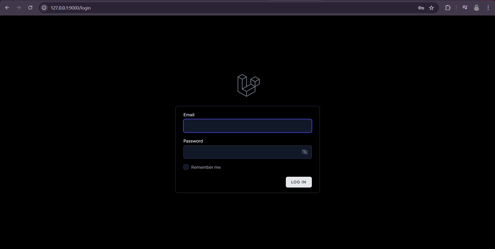

## 2. Dashboard Admin
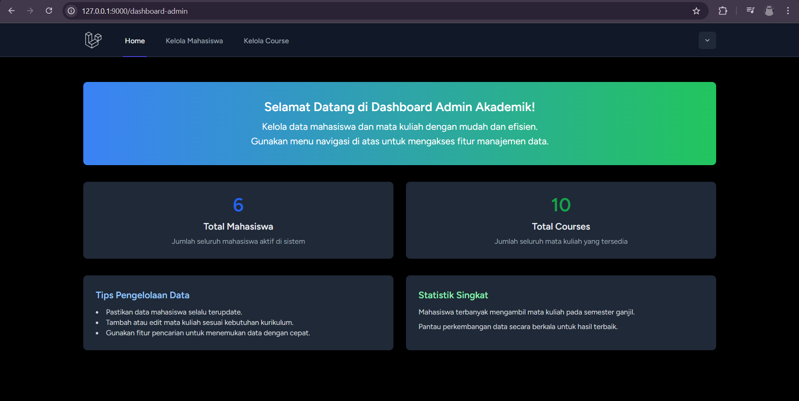

## 3. Dashboard Student
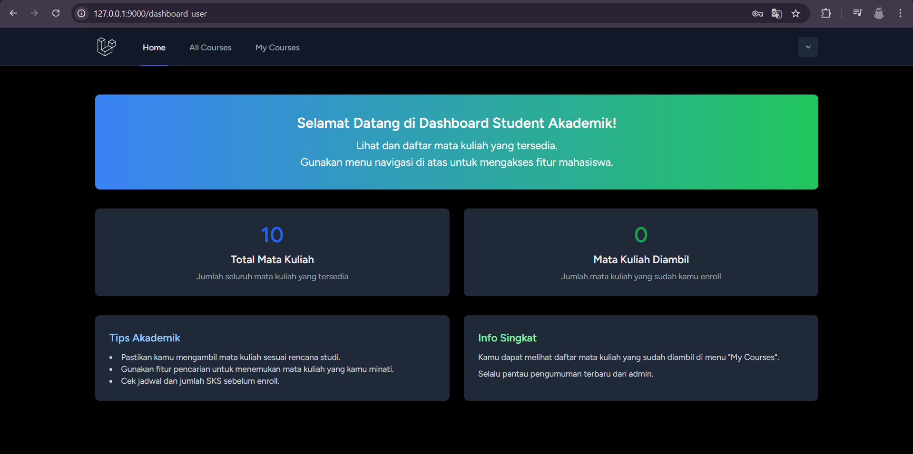

## 4. Kelola Mahasiswa
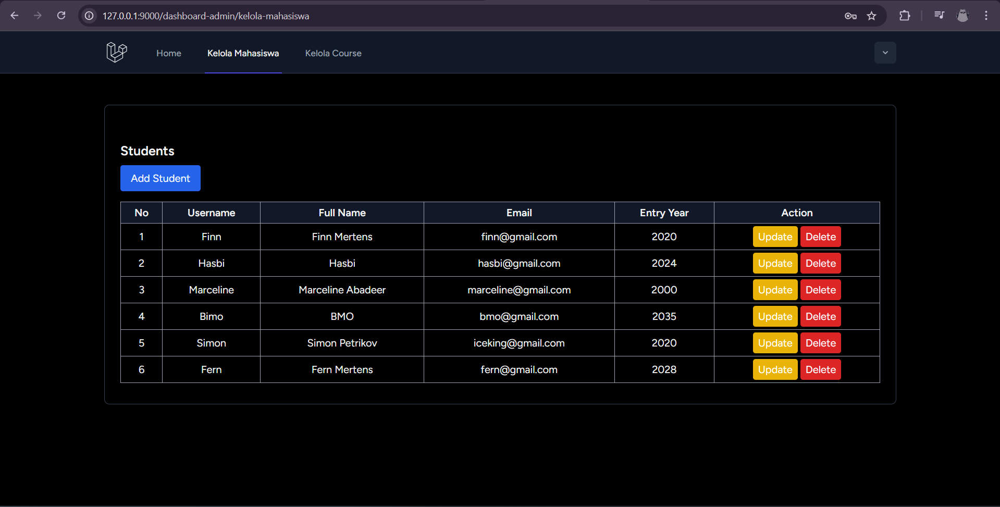

### - Create Mahasiswa
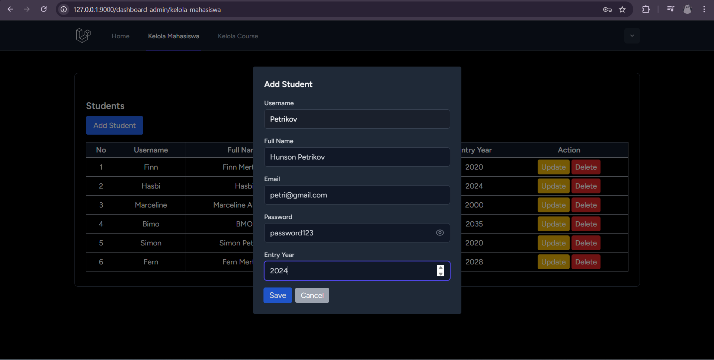
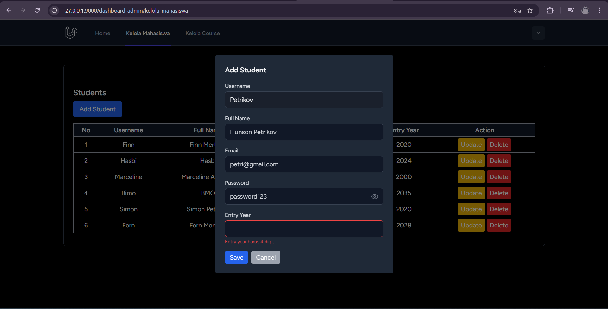

### - Edit Mahasiswa
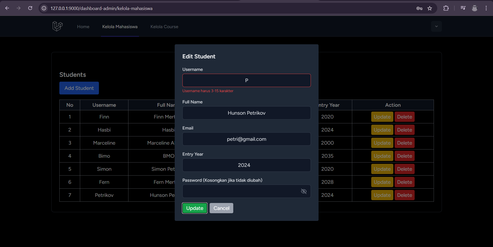

### - Delete Mahasiswa


## 5. Kelola Mata Kuliah (Course)
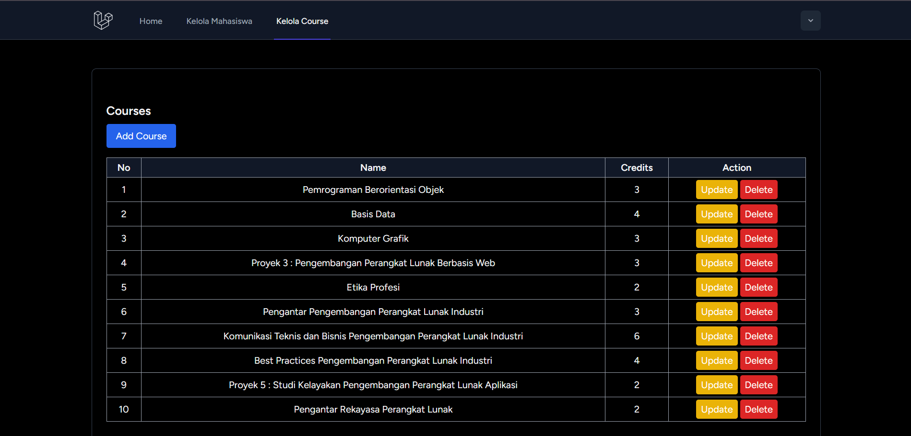

### - Create Course


### - Edit Course
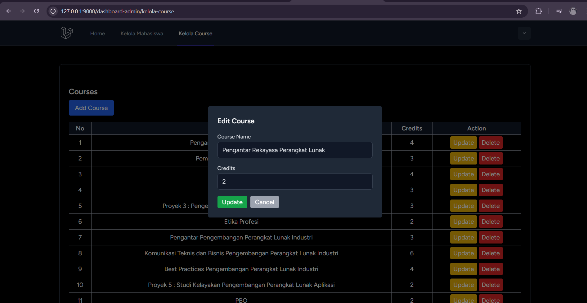

### - Delete Course
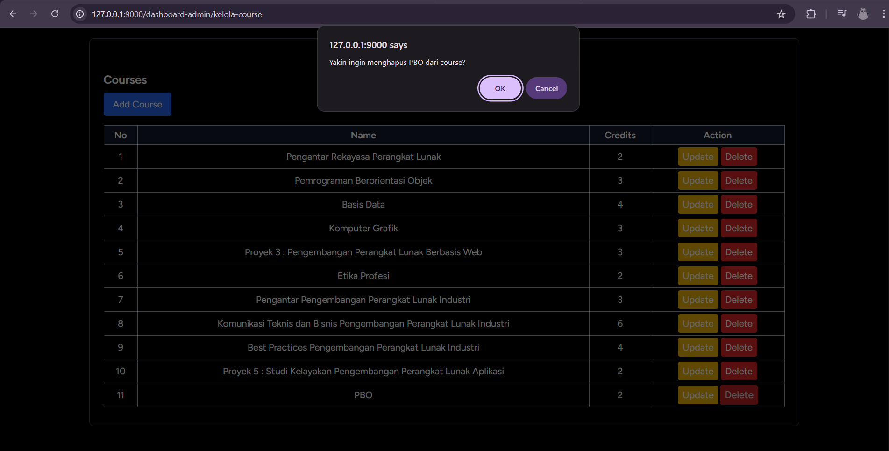

## 6. All Courses (Student)
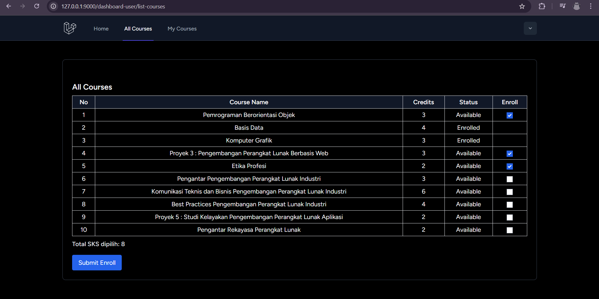

## 7. My Courses (Student)
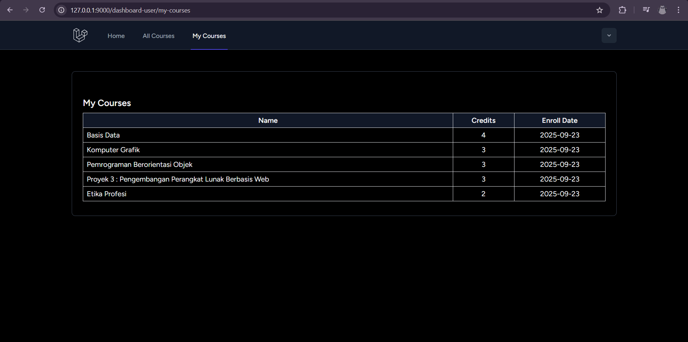

## 8. Profile
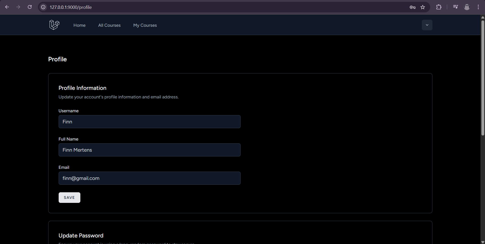
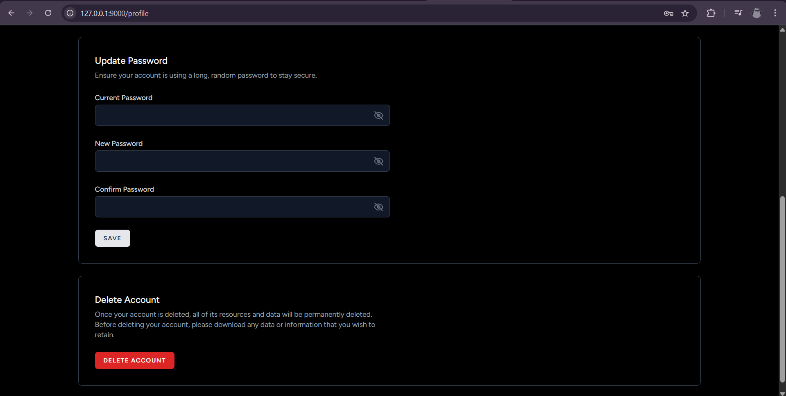

## 9. Logout
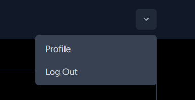

